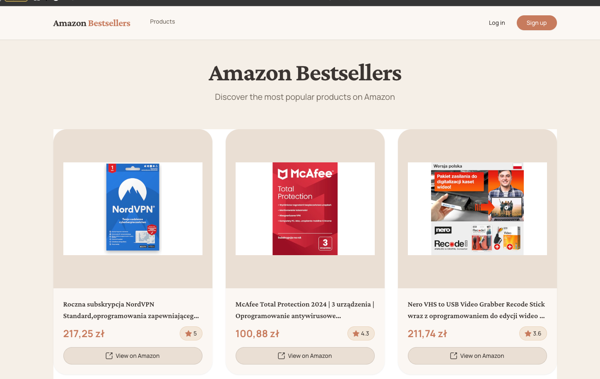

# Amazon BestSellers Explorer

Full-stack app for browsing Amazon bestsellers with auth and favorites.



## Requirements

- Docker Desktop
- .NET 9.0 SDK
- Node.js 18+

## Quick Start

```bash
cp .env.example .env
# Edit .env with your credentials
./init.sh
./start.sh
```

Open http://localhost:4200

## Environment Setup

Generate secure secrets:
```bash
# JWT secret (64+ chars)
openssl rand -base64 64

# DB passwords (32+ chars)
openssl rand -base64 32
```

Get RapidAPI key from [real-time-amazon-data](https://rapidapi.com/letscrape-6bRBa3QguO5/api/real-time-amazon-data)

Edit `.env` with generated values.

## Tech Stack

**Frontend:** Angular 19, PrimeNG, Tailwind CSS
**Backend:** .NET 9, EF Core, MariaDB, JWT
**Testing:** xUnit, Playwright

## Access

- Frontend: http://localhost:4200
- API: https://localhost:7196
- Swagger: https://localhost:7196/swagger

## Commands

```bash
# Run tests
cd backend && dotnet test

# E2E tests
npx playwright test

# Stop services
./stop.sh

# Reset database
docker-compose down -v && ./init.sh
```

## API Endpoints

- `POST /api/auth/register`
- `POST /api/auth/login`
- `GET /api/products/bestsellers`
- `GET /api/favorites`
- `POST /api/favorites`
- `DELETE /api/favorites/{id}`

## Production

Build with Docker:
```bash
docker build -t amazon-bestsellers .
docker run -p 5196:5196 --env-file .env amazon-bestsellers
```
